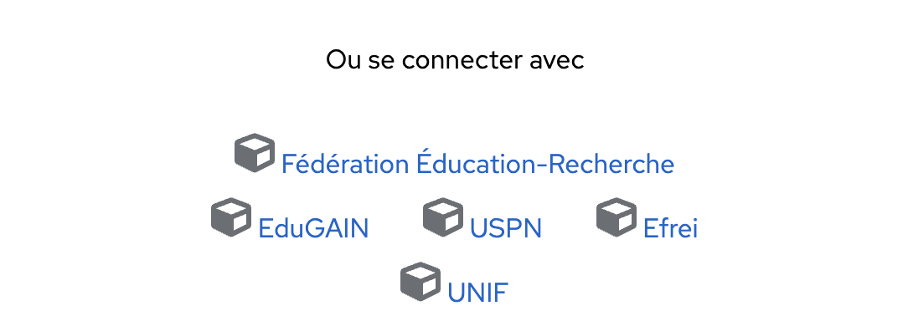
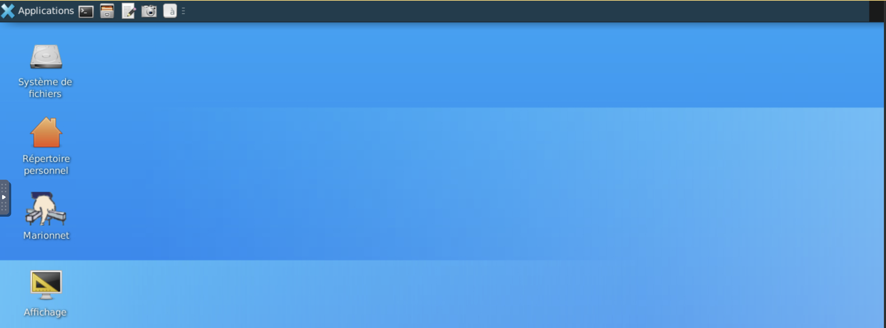

### C'est quoi MarioNum ?

**MarioNum** est une plateforme interactive d’auto-formation au numérique développée par le MESRI (Ministère de l’Enseignement Supérieur, de la Recherche et de l’Innovation). Il a été conçu comme un cloud éducatif, incluant au cœur de son projet des innovations technologiques et pédagogiques, une inclusivité multi-dimensionnelle, l’économie et la sobriété énergétique et numérique.

MarioNUM a été construit autour des objectifs suivants :
    
- **Enrichir la palette des outils de virtualisation des laboratoires** pour couvrir d’autres domaines du numérique les objets connectés, les réseaux sans fil et la cybersécurité sont les premières étapes planifiées dans ce projet.
- **Rendre accessible ces innovations au plus grand nombre**  d’apprenants et d’enseignants, en tenant compte d’objectifs de sobriété économique, numérique et environnementale et d’inclusivité (apprenants éloignés géographiquement, temporellement ou par des handicaps). Le projet sera donc hébergé en cloud dans le Datacenter labellisé par le Ministère de l’Enseignement Supérieur et de la Recherche, un choix animé par ce besoin de sobriété, de mutualisation des moyens et d’ouverture des applicatifs à l’ensemble de l’écosystème de l’Enseignement Supérieur. La refonte de l’interface utilisateur (UX/UI) favorisera aussi son accessibilité et son inclusivité auprès d’un large public.
- **Fournir un contenu pédagogique riche et innovant au travers de capsules pédagogiques** variées, mais aussi en fournissant un support réel de situations d’apprentissage et d’auto-évaluation. D’une part, l’exploration de techniques IA pour la recommandation des parcours pédagogiques permettra aux apprenants d’améliorer leurs résultats. D’autre part, l’enrichissement des contenus pédagogiques est prévu en mode collaboratif et certains acteurs nationaux ont d’ores et déjà témoigné de leur intérêt comme l’ADIUT, l’université numérique IUT en Ligne et l’Assemblé des département Réseaux & télécoms de France.

!!! objectifs "Pourquoi MarioNum dans le cadre de ce cours ?"
    L’objectif du cours est de **maîtriser les fondamentaux de Linux à travers des manipulations concrètes en ligne de commande**. MarioNum est une **excellente passerelle pédagogique** vers cet objectif.

    MarioNum nous permettra :
    
    - Être initié à l’environnement Linux de manière guidée.
    - Apprendre à son rythme avec des modules progressifs.
    - Gagner en efficacité dès les premiers TP.


### Prise en main de MarioNum

!!! info "Notez bien"
    Avant le début de chaque TP, vous recevrez des identifiants de connexion pour accéder à MarioNum.

1. Ouvrir un navigateur (Firefox, Chrome, Edge…).
2. Accéder au site MarioNum via le lien qui vous sera fourni et aller en bas de la page et vous verrez l'image ci-dessous. Cliquer sur **"Efrei"** 

3. Entrer vos paramètres d'authetification de myEFREI (Login + mot de passe)
4. Ensuite cliquer sur "**Rejoindre le TP**".

5. Vous obtiendrez la page ci-dessous. Cliquer sur connecter et introduisez le mot de passe qui vous a été fourni en début de TP.

6. L'interface suivante s'affichera 

7. Faites un clic sur "**Applications**" --> "**Émulateur de terminal**" --> Puis tapez les commandes suivantes 
```bash
   whoami
   hostname
   ls /
   uname -a
```

!!! info
    Ne vous inquietez pas, nous reviendrons plus en détail sur ces commandes durant le cours!