# Installation d'une distribution Linux 

## Installation d'une distribution Linux via VirtualBox sur Windows et MacOS 

!!! objectifs "Objectif pédagogique"
    Dans ce tutoriel, vous allez apprendre à installer une distribution Linux (Debian 12) dans une machine virtuelle à l’aide du logiciel **VirtualBox**.

!!! tip "Prérequis"

    Avant de commencer, assurez-vous d’avoir :

    - Une connexion internet stable
    - Au moins **10 Go d’espace libre**
    - **VirtualBox** installé sur votre système :

        > **Windows** 
      
        > ou **MacOS (Sur des processeurs Intel)**
     
    - Le fichier **ISO** de Debian (image disque)

!!! warning "Attention à la puce Apple Silicon (M1/M2/M3)"
    VirtualBox ne prend pas encore pleinement en charge les puces Apple Silicon. Pour ces machines, privilégiez UTM 

!!! info "Instructions"

    Il est essentiel de suivre attentivement les instructions, certaines étapes étant spécifiques à Windows, à macOS (processeur Intel), ou aux deux. Veillez donc à respecter scrupuleusement les indications correspondant à votre système.

    Pour l'installation de :
    
    - **Windows :** suivre les étapes 1, 2, 3, 4, 5, 6, 7, 9
    - **MacOs :**.  suivre les étapes 1, 2, 3, 5, 6, 8, 9


### Étape 1 : Télécharger VirtualBox

1. Allez sur le site officiel : [https://www.virtualbox.org](https://www.virtualbox.org)
2. Cliquez sur le bouton **Download VirtualBox**.
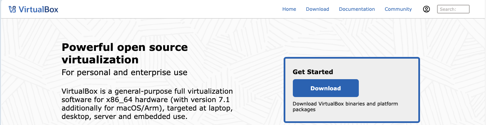
3. Choisissez la version adaptée à votre système d’exploitation (Windows, macOS, Linux).
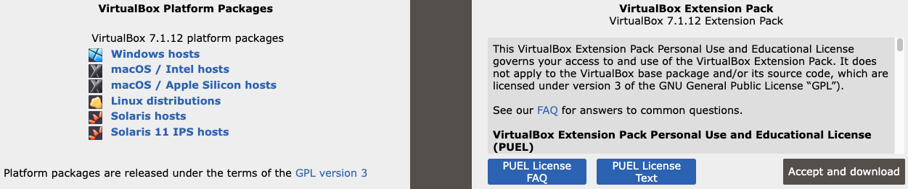
4. Une fois le fichier téléchargé, **installez VirtualBox** en suivant l’assistant d’installation.

!!! info "Extension Pack"
    Il est recommandé d’installer le "VirtualBox Extension Pack" pour bénéficier de fonctions supplémentaires comme le copier-coller entre hôte et invité.

---

### Étape 2 : Télécharger l’image ISO de Debian

1. Rendez-vous sur : [https://www.debian.org/](https://www.debian.org/)
2. Téléchargez la version 64 bits (amd64) : **debian-12.11.0-amd64-netinst.iso**

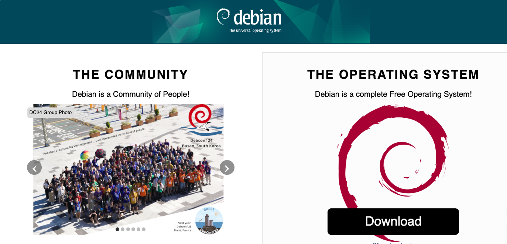

---

### Étape 3 : Créer une machine virtuelle

1. Lancez VirtualBox et cliquez sur **"Nouvelle"**.
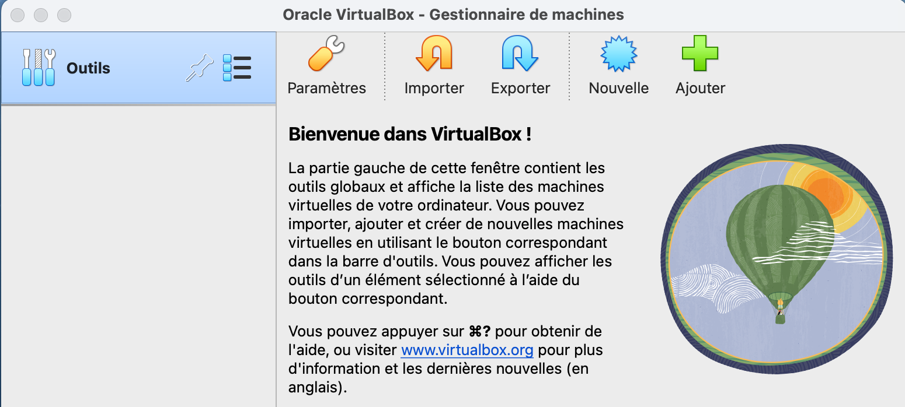
2. Donnez un nom à votre machine virtuelle (par exemple "**Debian12**").
3. Choisissez :
     - **Type :** Linux
     - **Version :** Debian (64-bit)
4. Cliquez ensuite sur **"Suivant"**.   
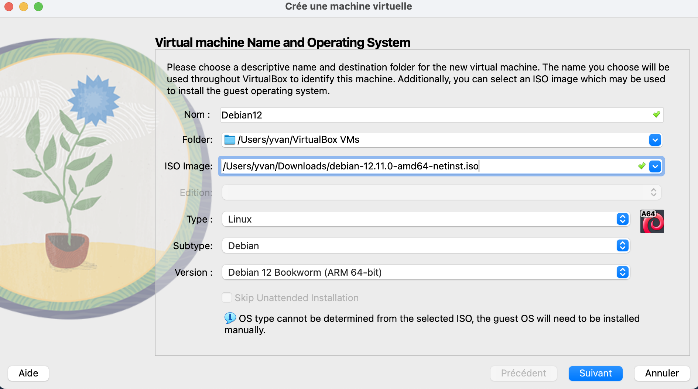


---

### Étape 4 : Configuration des paramètres utilisateurs 

!!! info "Notez bien"

    **Cette étape concerne exclusivement l'installation sous Windows.**
    
    Assurez-vous que le nom d'utilisateur soit entièrement en minuscules. 
    
    - **Exemple :** yvan
    - Vous pouvez également conserver le nom d'utilisateur par défaut qui vous est proposé
<!--  
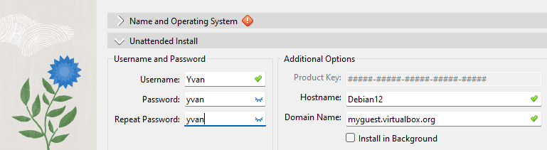
-->

### Étape 5 : Allouer de la mémoire vive (RAM)

Allouez au moins **2048 Mo** (2 Go) si vous avez assez de RAM.

!!! tip "Recommandation"
    Ne dépassez pas 50 % de votre mémoire totale.
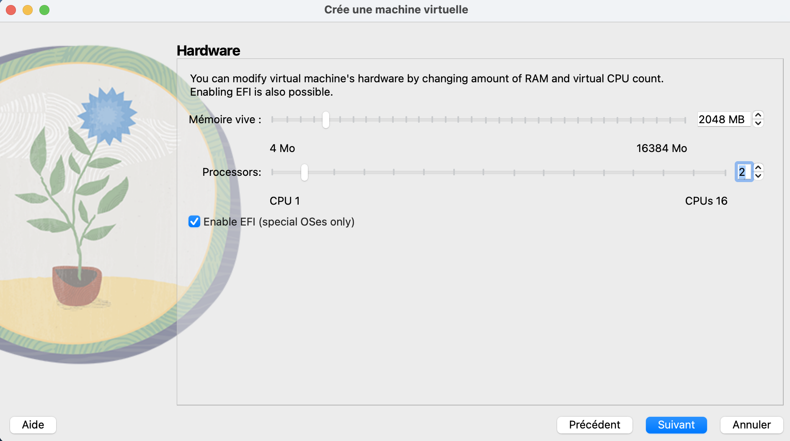


---


### Étape 6 : Créer un disque dur virtuel

1. Choisissez **"Créer un disque dur virtuel maintenant"**.
2. Laissez le type **VDI** (VirtualBox Disk Image) par défaut.
3. Choisissez **allocation dynamique**.
4. Définissez une taille de disque de **10 Go ou plus**.
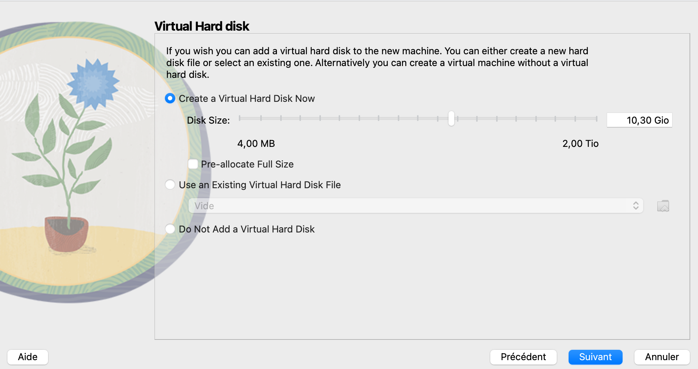
5. Vérifier les paramètres de vos **"Configurations"**.
6. Ensuite cliquer sur "**Finish**"
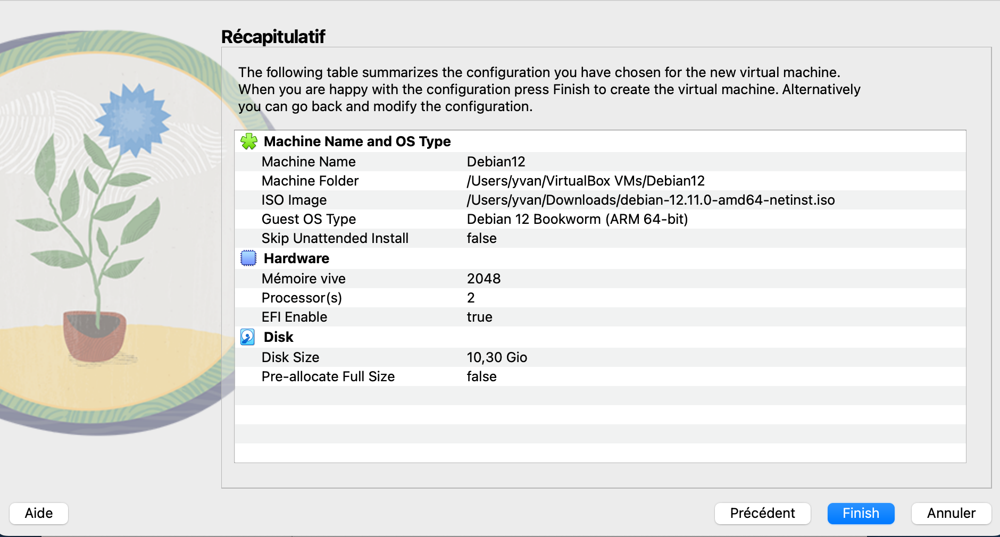

### Étape 7 : Finalisation de l'installation sous Windows

1. Une fois l'installation terminée, entrer vos paramètres de connexion
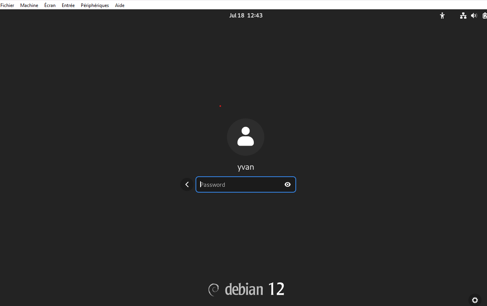 
2. Fermez les différentes fenêtres qui vont s'afficher.
3. Ensuite cliquer sur "**Show Applications**"
4. Vous pouvez ensuite ouvrir le "**Terminal**"
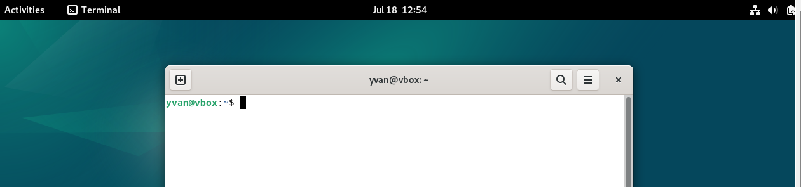 

### Étape 8 : Vérifier que l’image ISO a bien été inséré et finalisation de l'installation sous MacOS

1. Une fois la VM créée, sélectionnez-la et cliquez sur **"Configuration"**.
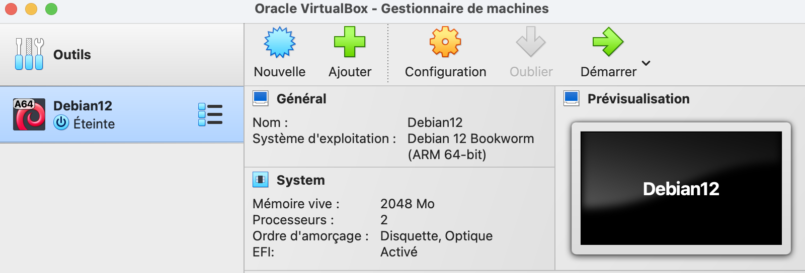
2. Allez dans l’onglet **"Stockage"**.
3. Cliquez sur le lecteur vide et sélectionnez **"Choisir un fichier disque"**.
4. Sélectionnez l’ISO Debian téléchargé.
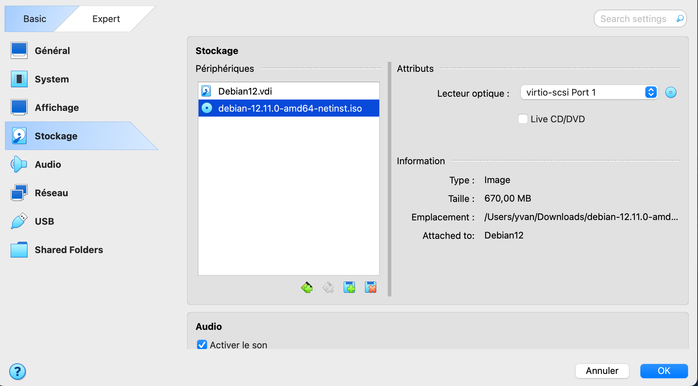
5. Cliquez sur **"Démarrer"** pour lancer la VM.
6. L’installateur Debian va apparaître. Choisissez **Install** ou **Graphical Install**.
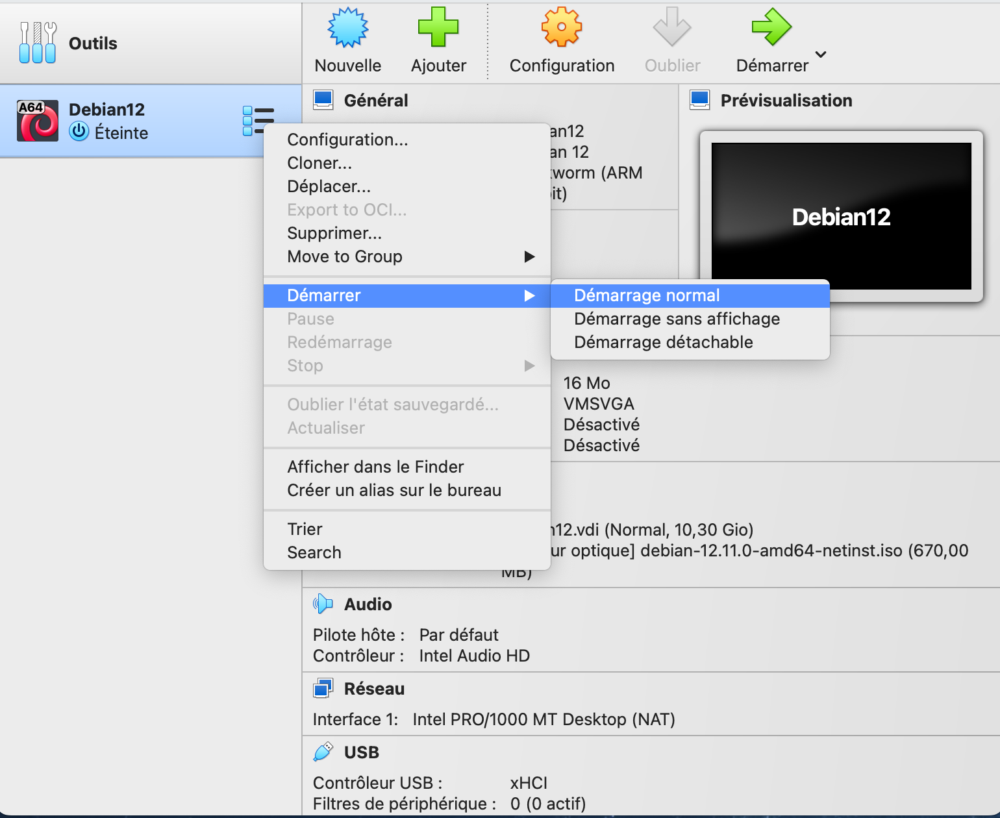
7. Suivez les étapes :
    - Choisissez la langue, la localisation, le clavier
    - Définition du nom de l’ordinateur.
    - **Création du compte utilisateur + mot de passe** (utilisez un nom simple en minuscules et ne contenant pas d'espace.) 
8. Partitionner le disque
    - Choisissez  **Guided – use entire disk**
    - Choisissez le disque proposé (**sda** en général)
    - Choisissez **All files in one partition**
    - Confirmez avec **Finish partitioning and write changes to disk**
9. Installation du système
    - L'installation démarre, attendez la fin
    - Acceptez l’installation du **GRUB bootloader** si demandé.
    - Terminez et redémarrez la machine virtuelle.
---

### Étape 9 : Vérification finale et test

!!! info "À faire"
    1. Une fois l’installation terminée, pensez à retirer l’ISO de l’installation :
        - Allez dans "**Périphériques**" > "**Lecteurs optiques**"
        - Si l'image iso n'est pas retirer (**debian-12.11.0-amd64-netinst.iso**), cliquer sur "**Retirer le disque**"
    2. Testez quelques commandes :
    ```bash
        whoami
        hostname
        ls /
        uname -a
    ```
<!--


3. Vous devriez arriver sur l’écran de connexion de Debian 🎉
-->

---
## Installation d'une distribution Linux via UTM sur MacOS (Puces M1/M2/M3)


!!! objectifs "Objectif pédagogique"
    Permettre aux étudiants d’installer un système GNU/Linux Debian dans un environnement virtualisé adapté aux Mac équipés de puces  Apple Silicon (M1/M2/M3), afin de découvrir un OS libre et pratiquer en toute sécurité.

### Prérequis

Avant de commencer, assurez-vous de disposer : 

- D’un **Mac avec une puce Apple Silicon (M1 ou M2 ou M3)**.
- D’au moins **8 Go de RAM** et **20 Go d’espace libre.**
- D'une bonne connexion internet

### Étape 1 : Télécharger et installer UTM

1. Rendez-vous sur le site officiel : [https://mac.getutm.app/](https://mac.getutm.app/)
2. Cliquez sur Download
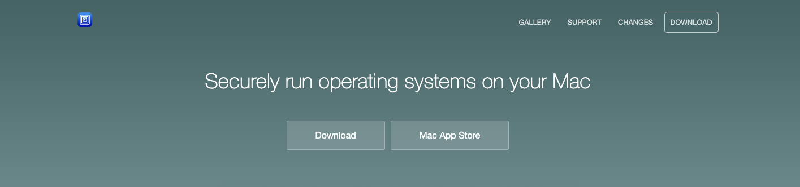
3. Ouvrez le fichier .dmg puis glissez UTM.app dans votre dossier Applications.

### Étape 2 : Télécharger Debian pour ARM64

!!! warning
    N’utiliser pas d’image “**x86_64**”, car elle est incompatible avec les puces M1/M2/M3 sans émulation lente.
    
1. Allez sur : [https://cdimage.debian.org/debian-cd/current/arm64/iso-cd/](https://cdimage.debian.org/debian-cd/current/arm64/iso-cd/)
2. Téléchargez la version netinst (cliquez par exemple sur **debian-12.11.0-arm64-netinst.iso**).
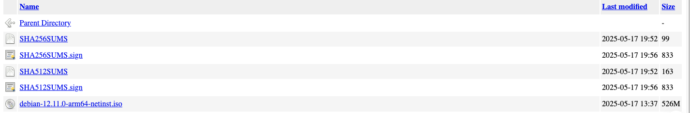
3. Enregistrez le fichier dans un endroit accessible (par exemple **Téléchargements**).


### Étape 3 : Créer une nouvelle machine virtuelle dans UTM

1. Ouvrez UTM.
2. Cliquez sur + pour créer une nouvelle VM.
3. Cliquez sur **Virtualize** (et non Emulate).
4. Choisissez l’option Linux, puis selectionner le fichier precedemment téléchargé.
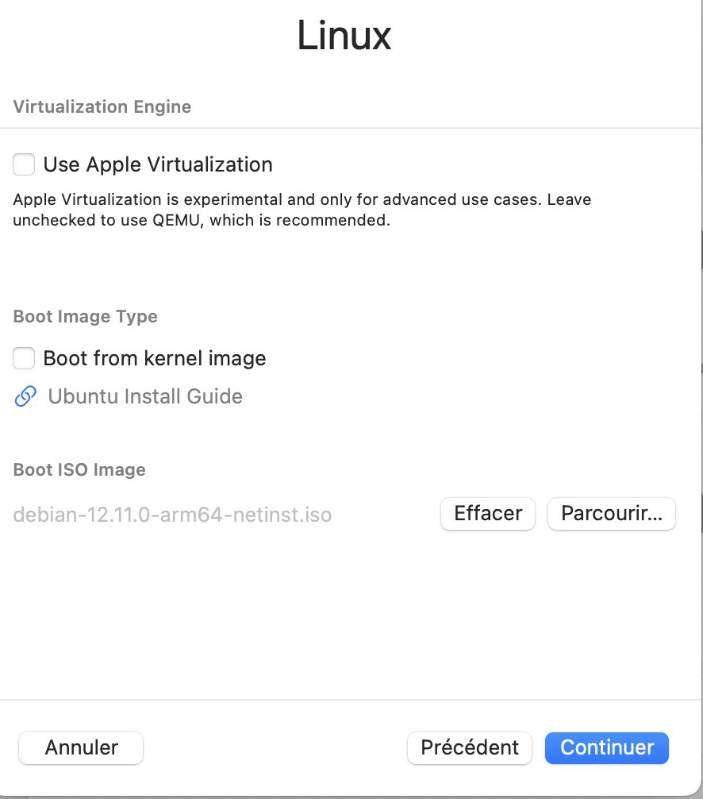
5. Cliquez sur Continuer.


### Étape 4 : Définir la mémoire, le stockage et créer la VM

1. Allouez 4 Go de RAM (4096 Mo).
2. Allouez 2 CPU minimum.
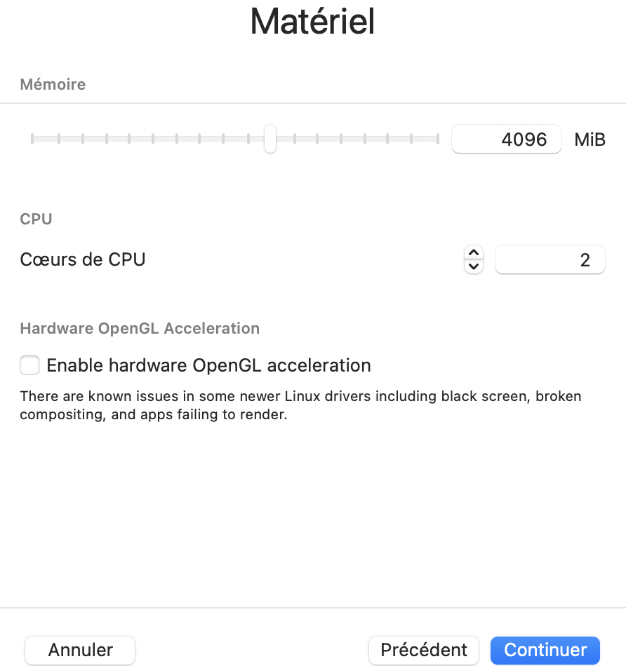

3. Allouez 20 Go de stockage minimum.
4. Donnez un nom (ex. : **Debian-UTM-M1**).
5. Cliquez sur **Enregistrer**

### Étape 5 : Lancer la machine virtuelle

1. Cliquez sur la VM dans la liste (ex. : **Debian-UTM-M1**).
2. Cliquez sur Play. 
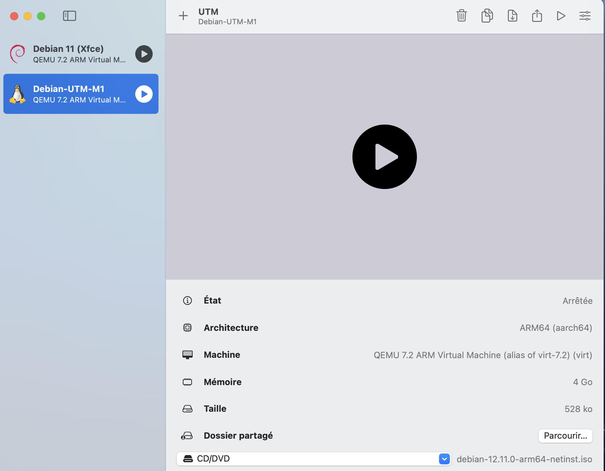
3. Cliquer sur "**Install**". Ensuite suivez les instructions d'installation de la distribution :
     - Choix de la langue;
     - Partition automatique;
     - Création de l'utilisateur;
     - Mot de passe root
4. Redémarre une fois l'installation terminée.

!!! tip
    Si tu vois un écran noir au redémarrage, éteins la VM, va dans **Settings --> Drives** et retire l’ISO.
    Ensuite redémarrer à nouveau la machine virtuelle. 

### Étape 6 : Première utilisation

1. Connexion avec vos paramètres utilisateurs
2. Lancer le terminal (`Ctrl + Alt + T` ou via le menu).
3. Taper les commandes suivantes :
```bash
uname -a
lscpu
lsblk
```
4. Mise à jour de la distribution :
```bash
sudo apt update && sudo apt upgrade
```