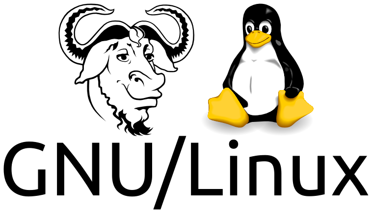
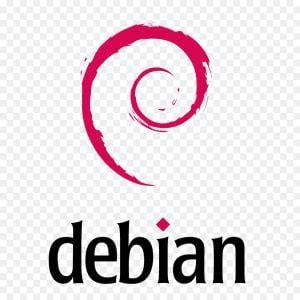

Dans ce cours d'introduction, nous allons apprendre à utiliser le système d'exploitation Linux à travers la distribution Debian. Nous apprendrons à utiliser l'interface en ligne de commande (CLI) et à utiliser le shell pour interagir avec le système d'exploitation. Nous apprendrons également à utiliser le shell pour écrire des scripts et automatiser des tâches.

Cette première lecture préliminaire permet de comprendre la genèse de Linux et de saisir la philosophie qui se cache derrière ce système d'exploitation. Elle permet également de comprendre pourquoi il est si populaire, même si vous n'en avez jamais entendu parler auparavant. Oui, vous ne le savez peut-être pas, mais vous l'utilisez déjà tous les jours. Une définition d'un shell est également fournie.

### Qu'est-ce qu'un système d'exploitation ?

Selon Wikipédia, l'encyclopédie libre, un système d'exploitation (SE) est un logiciel qui gère les ressources matérielles et logicielles de l'ordinateur et fournit des services communs pour les programmes informatiques.

Il reçoit des demandes d'utilisation des ressources de l'ordinateur - ressources de stockage de la mémoire (par exemple, accès à la RAM, disques durs), ressources de calcul du processeur central, ressources de communication vers les périphériques (par exemple, pour demander des ressources de calcul du GPU ou de toute autre carte d'extension) ou via le réseau - à partir du logiciel d'application. Le système d'exploitation gère ces demandes et les ressources nécessaires pour éviter les interférences entre les applications logicielles.

### Qu'est-ce qu'UNIX ?

UNIX est un système d'exploitation (SE) développé à l'origine par Ken Thompson chez Bell Labs, la légendaire branche de recherche d'AT&T (l'ancien monopole américain des télécommunications) en 1969 et a été considérablement amélioré à l'Université de Californie à Berkeley (UCB) au cours des années 1970 et 1980. De nombreuses variations ont ensuite été développées, et elles sont collectivement appelées systèmes d'exploitation de type Unix ou basés sur Unix. Les systèmes d'exploitation basés sur Unix sont largement considérés comme les meilleurs systèmes d'exploitation jamais créés en termes de plusieurs critères, notamment la stabilité, la sécurité, la flexibilité, la scalabilité et l'élégance.

### Qu'est ce que Linux et GNU/Linux ?

Linux est un système d'exploitation (SE) gratuit et performant similaire à UNIX. Linus Torvalds a commencé Linux (une concaténation de Linus et UNIX) en 1991, dans le but de créer une alternative UNIX gratuite en raison de son insatisfaction à l'égard de MS-DOS. Il est rapidement devenu un projet mondial, attirant des développeurs du monde entier [^1], ce qui a conduit à des améliorations continues des performances et à une adoption généralisée par les particuliers, les entreprises, les établissements d'enseignement et les gouvernements.

La supériorité de Linux par rapport aux autres systèmes de type Unix réside dans le fait qu'il est complètement gratuit, à la fois sur le plan monétaire et en termes de droits d'utilisation. Cette liberté est rendue possible par la licence publique générale [GNU (GPL)](https://fr.wikipedia.org/wiki/Licence_publique_g%C3%A9n%C3%A9rale_GNU), associée au projet GNU lancé par Richard Stallman en 1983, qui fournit des programmes utilitaires essentiels pour Linux, d'où le nom GNU/Linux.

Comparé à Microsoft Windows, le système d'exploitation le plus utilisé, Linux offre plusieurs avantages : (1) être gratuit, (2) une grande stabilité avec moins de plantages, (3) une forte résistance aux virus et aux logiciels malveillants, (4) la disponibilité de nombreux logiciels gratuits de haute qualité, et (5) la compatibilité avec les anciens ordinateurs incapables de prendre en charge les nouvelles versions de Windows. Pour une liste plus complète des avantages, l'article ["25 Reasons to Convert to Linux"](http://www.linfo.org/reasons_to_convert.html) peut fournir d'autres informations.

### Qu'est-ce qu'une distribution Linux ?

Une distribution est un système d'exploitation complet composé d'un *noyau* (c'est-à-dire le cœur d'un système d'exploitation) et d'utilitaires (dont certains sont également nécessaires au fonctionnement du système d'exploitation) ainsi que d'une variété de programmes d'application.

Il existe une centaine de distributions de Linux disponibles actuellement. Elles sont livrées avec diverses saveurs, de la plus conviviale pour les débutants complets à la plus avancée pour les experts. Les plus populaires d'entre elles sont Ubuntu, Fedora, Debian.

La plupart de ces distributions sont disponibles (1) en anglais, (2) pour les processeurs compatibles Intel (x86) et (3) en téléchargement gratuit sur Internet. Elles sont également disponibles (4) dans d'autres langues et (5) pour d'autres types de processeurs.

Dans ce module nous allons commencer notre découverte Linux avec Debian.

### Qu'est-ce que Debian

Debian est un système d'exploitation (SE) gratuit basé sur un noyau de type UNIX (Linux ou FreeBSD) qui peut être téléchargé [ici](https://www.debian.org/download). Vous pouvez trouver plus d'informations sur Debian [ici](https://www.debian.org/intro/about).

### Historique du développement d'UNIX et de Linux

- 1969: Ken Thompson développe la première version d'UNIX chez Bell Labs.
- 1973: UNIX est réécrit dans le langage de programmation C, ce qui augmente considérablement sa portabilité.
- 1983: Richard Stallman lance le projet GNU pour créer un système d'exploitation de type UNIX gratuit fournissant de nombreux utilitaires.
- 1985: La Free Software Foundation est fondée pour soutenir le projet GNU.
- 1987: Andrew Tanenbaum développe MINIX, un système d'exploitation de type UNIX gratuit à des fins éducatives.
- 1991: Linus Torvalds lance Linux comme projet de loisir.
- 1992: Linux est re-licencié sous la GNU GPL.
- 1993: Le projet Debian est fondé pour créer un système d'exploitation de type UNIX gratuit.

### UNIX aujourd'hui

- **Gnu/Linux** noyau Linux + utilitaires GNU, équipe la plupart des serveurs et supercalculateurs, et est de plus en plus utilisé sur les ordinateurs de bureau et portables (1% à 2%).
- **Android** noyau Linux + utilitaires Android, équipe la plupart des smartphones et tablettes (80%).
- **FreeBSD** OS de type UNIX, équipe la plupart des ordinateurs Apple Macintosh (10%), et l'OS de Playstation 3 et 4.
- **iOS et MacOS** OS de type UNIX, équipe les iPhones et iPads et les Macs d'Apple.

### Mais le shell dans tout ça ?

Nous avons vu qu'un SE gère les demandes d'utilisation des ressources de l'ordinateur. Ces demandes sont faites à travers une interface utilisateur. Il existe deux types d'interfaces utilisateur : (1) les interfaces utilisateur graphiques (GUI) et (2) les interfaces utilisateur en ligne de commande (CLI).

Un shell est un programme qui fournit l'interface utilisateur traditionnelle, uniquement textuelle, pour les systèmes d'exploitation de type Unix. Sa fonction principale est de lire les commandes (c'est-à-dire les instructions) qui sont saisies dans une console (c'est-à-dire un mode d'affichage tout texte) ou une fenêtre de terminal (c'est-à-dire un mode d'affichage graphique), puis de les exécuter.

Dans ce module nous allons utiliser le shell Bash. Bash est le shell du projet GNU. Bash est le Bourne Again SHell. Bash est un shell compatible sh qui intègre des fonctionnalités utiles du shell Korn (ksh) et du shell C (csh). Il est destiné à se conformer à la norme IEEE POSIX P1003.2/ISO 9945.2 Shell and Tools. Il offre des améliorations fonctionnelles par rapport à sh pour la programmation et l'utilisation interactive. De plus, la plupart des scripts sh peuvent être exécutés par Bash sans modification.

[^1]: Plus tard, Linus Torvalds inventera Git pour gérer le développement du noyau Linux, car son développement s'est répandu dans le monde entier.

