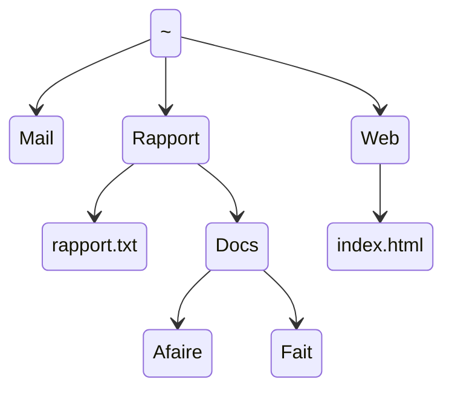

# TP1 - Premières commandes

!!! objectifs "Objectifs pédagogiques"

    À l’issue de ce TP, l’étudiant sera capable de :

    - Se repérer dans l’arborescence du système de fichiers Linux
    - Comprendre et utiliser les commandes de base du shell (naviguer, créer, déplacer, supprimer)
    - Utiliser les raccourcis clavier essentiels du terminal
    - Comprendre la distinction entre commandes internes et externes
    - Consulter l’aide en ligne (man, help) et lire un synopsis de commande
    - Comprendre la différence entre chemins absolus et relatifs
    - Manipuler les répertoires et les fichiers en ligne de commande
    - Utiliser les caractères jokers (wildcards) pour rechercher ou manipuler des fichiers
    - Appliquer la complétion automatique et les raccourcis utiles pour gagner en efficacité


!!! info "Instructions"
    
    - Dans tous les exercices, la chaîne `$ ` au début de la ligne représente l'invite de commande et ne doit pas être saisie.
    - Pour l'instant, à chaque fois que vous ouvrez un terminal, vous êtes invité à saisir la commande suivante, (suivie, comme toujours, de la touche entrée), pour des raisons pédagogiques :

    ```bash
    $ PS1='$ '
    ```

!!! warning "À propos des réponses du TP"

    Avant de commencer le TP, vous devez créer un fichier nommé **`resultat_commande_TP1_NomPrenomEtudiant.txt`**.  
    Dans ce fichier, vous consignerez progressivement les résultats des commandes exécutées au fil des exercices.  

    > **Création du fichier**
    
    1. Clic droit dans votre répertoire de travail  
    2. Créer un document → Fichier vide 
    3. Nommer le fichier : `resultat_commande_TP1_NomPrenomEtudiant`  

    > **Notez bien :**  
    >> <span style="color:blue"> Votre enseignant doit pouvoir consulter ce fichier à tout moment afin d’évaluer votre progression. </span>

 


!!! tip "Barème d’interprétation des exercices"

    > 📚 = Facile, 📚📚 = Moyenne, 📚📚📚 = Élevée 


### Exercice 1 : Premières commandes 📚

!!! tip "Qu'est-ce qu'une commande ?"

    Une *commande* est une séquence de mots se terminant par un caractère de nouvelle ligne. Autrement dit, une commande est une séquence de caractères qui se termine par la touche <kbd>⏎ Entrée</kbd>. Le premier mot est le nom de la commande, les autres sont ses *arguments*. La commande est exécutée par le shell, qui est un programme qui interprète la ligne de commande.

    ```bash
    $ touch file.txt
    ```
    Ici la commande est `touch` et son argument est `file.txt`. Le signe `$` au début de la ligne est l'invite de commande. Il ne fait pas partie de la commande.

    Chaque mot de la ligne de commande est séparé par un ou plusieurs espaces. Le shell interprète les espaces comme des séparateurs entre les mots. Le shell interprète le caractère de nouvelle ligne comme la fin de la commande.

1. Essayez les commandes suivantes dans un terminal. Décrivez en une phrase son utilité, indiquez le nom de la commande, son nombre d'arguments et ses arguments. Par exemple, la première commande est `date`, elle n'a pas d'argument et son utilité est d'afficher la date et l'heure.
```bash
$ date
$ cal
$ cal 3 2022
$ who
$ who am i
$   who  am   i
$ uname
$ uname -m -r
$ uname -mrs
$ echo Hello, world!
$ echo       Hello,        world!
```
2. Appuyez sur la touche <kbd>↑</kbd> (flèche vers le haut) de votre clavier, ou bien <kbd>Ctrl</kbd> + <kbd>P</kbd> (<kbd>Ctrl</kbd> et <kbd>P</kbd> en même temps), plusieurs fois jusqu'à ce que la commande `who` s'affiche. Appuyez maintenant sur la touche <kbd>↓</kbd> (flèche vers le bas) ou bien tapez <kbd>Ctrl</kbd> + <kbd>N</kbd> jusqu'à ce que la commande `uname -m -r` s'affiche puis appuyez sur la touche entrée. Notez à quoi servent ces raccourcis et apprenez-les.
3. Appuyez sur <kbd>Ctrl</kbd> + <kbd>L</kbd>. Notez à quoi sert ce raccourci et apprenez-le.
4. Sans écrire la commande, afficher la commande `cal 3 2022`, *sans l'exécuter* (c'est-à-dire sans appuyer sur entrée).
5. Appuyez sur <kbd>Ctrl</kbd> + <kbd>U</kbd>. Notez à quoi sert ce raccourci et apprenez-le.
6. Affichez de nouveau la commande `uname`, sans l'écrire ni l'exécuter, puis appuyez sur <kbd>Ctrl</kbd> + <kbd>D</kbd>. Que se passe-t-il ?
7. Effacez la ligne de commande avec un raccourci clavier et appuyez de nouveau sur <kbd>Ctrl</kbd> + <kbd>D</kbd>. Que se passe-t-il ?
8. Ouvrez de nouveau un terminal Debian et appuyez plusieurs fois sur <kbd>Ctrl</kbd> + <kbd>P</kbd>. Qu'observez-vous ?
9. Fermez le terminal avec un raccourci clavier.

### Exercice 2 : Répertoires et fichiers 📚📚

1. Ouvrez un terminal Debian et tapez la commande suivante, en respectant sa syntaxe :
```bash
PS1='$ '
```
2. Entrez la commande `pwd` (*print working directory*), c'est-à-dire afficher le nom du répertoire courant et notez ce qui est affiché à l'écran : c'est le chemin absolu de votre répertoire personnel, votre *home*.
3. Entrez la commande `cd ..` (*change directory*,  avec un espace entre `cd` et `..`) puis `pwd`. Répétez plusieurs fois ces deux commandes jusqu'à ce que le résultat reste le même. Que s'est-il passé ?
4. Entrez la commande `cd` (sans argument), puis `pwd`. Commentez.
5. Entrez la commande `cd /`, puis `pwd` et `ls`. À quoi sert la commande `ls` ?
6. Entrez la commande `cd /usr/include`. Utilisez la commande `ls`. À quoi semble servir ce répertoire ?
7. La commande `cat` (*concatenate*) affiche un ou plusieurs fichiers donnés en arguments (l'un après l'autre) dans le terminal. La commande `wc` (*word count*) affiche (dans cet ordre) le nombre de lignes, de mots et de caractères des fichiers donnés en arguments, puis, s'il y en a plusieurs, les sommes de ces nombres pour tous les fichiers. Affichez le contenu du fichier `stdlib.h` et le nombre de lignes de ce fichier.
8. Entrez la commande `cd ..`, `pwd` et `ls`.
9. Entrez la commande `cd share/man`, puis `pwd` et `ls`. Pouvez-vous deviner à quoi se réfèrent certains des résultats affichés ?
10. Entrez la commande `ls /bin`. Certains noms vous sont-ils familiers ?
11. Le caractère `~` (qui se lit *tilde*) est entré au clavier avec la combinaison de touches `Alt Gr-2`. Entrez la commande `echo ~`, puis la commande `cd ~`. Que fait le shell au caractère `~` ?
12. Représentez les répertoires et fichiers mentionnés dans l'Exercice sous la forme d'un arbre (c'est-à-dire comme un arbre généalogique).

### Exercice 3 : Gestion de répertoires et de fichiers (1) 📚📚

!!! tip "Chemin d'accès"
    
    La référence à une ressource (fichier ou répertoire) s'appelle un chemin d'accès (en anglais : path). Dans ce chemin, sous Linux, les noms des répertoires et éventuel fichier sont séparés par un slash `/` (alors qu'on utilise un antislash `\` sous Windows).

    Il existe deux types de chemin : absolu et relatif. 

    1. Un chemin *absolu* se base sur la racine de l'arborescence et commence par `/`, par exemple : `/home/debian` est le chemin abslou vers le repertoire personnel de l'utilisateur debian. Il reste valable quel que soit le contexte.
    2. Un chemin *relatif* est a priori relatif au répertoire courant où se trouve l'utilisateur. ar exemple, si le répertoire courant est `/home/debian`, le chemin relatif `./Documents` fait référence au répertoire `/home/debian/Documents`.Un chemin qui commence par autre chose que `/` ou `~` est un chemin relatif. 

    Le `.` fait référence au répertoire courant. Les `..` font référence au répertoire parent.

!!! warning "Où se trouve `~` sur le clavier ?"

    - Sur un clavier azerty windows, le caractère `~` (tilde) est entré au clavier avec la combinaison de touches <kbd>Alt Gr</kbd> + <kbd>2</kbd>
    - Sur un clavier mac, le caractère `~` (tilde) est entré au clavier avec la combinaison de touches <kbd>Alt</kbd> + <kbd>N</kbd>

1. Assurez-vous d'être dans votre répertoire personnel et listez son contenu.
2. Entrez la commande `mkdir tp_shell` (pour *make directory*, c'est-à-dire créer un répertoire). Listez le contenu du répertoire personnel et du répertoire `tp_shell`.
3. Entrez la commande `mkdir abeilles tp_shell/tp1 ~/arbres`. Que fait-elle ? Parmi ses arguments, lesquels sont des chemins absolus et lesquels sont des chemins relatifs ? (indice : voir le résultat de `echo ~/arbres`).`
4. Que fait la commande suivante ?
    ```bash
    $ mkdir -p vivant/plante/fleur tp_shell/tp1/exos/ex1/
    ```
5. Le shell `bash` (qui est votre shell par défaut) possède une fonctionnalité qui fait gagner beaucoup de temps et évite les fautes de frappe : la complétion automatique. Elle se fait avec la touche de tabulation (la touche à gauche de la touche `a`). Entrez les caractères suivants (la touche de tabulation <kbd>⇥ Tab</kbd> est représentée ci-dessous par `<Tab>`) et observez le résultat dans le terminal :
    ```bash
    $ mkd<Tab> vi<Tab><Tab><Tab>roses
    ```
6. Quand plusieurs choix sont possibles, la tabulation ne déclenche pas la complétion, mais en appuyant deux fois de suite sur la touche de tabulation, la liste des choix possibles est affichée : essayez avec
    ```bash
    $ ls a<Tab><Tab>
    ```
7. La commande `rmdir` (pour *remove directory*) permet de supprimer des répertoires. Testez-la avec la commande
    ```bash
    $ rmdir vivant tp_shell/tp1/exos/ex1
    ```
et supprimez le sous-répertoire `tp1` du répertoire `tp_shell`.
1. La commande `touch` permet (entre autres) de créer des fichiers vides (normaux). Observez le résultat de la commande (exécutée depuis votre répertoire personnel) :
    ```bash
    $ touch ~/arbres/hello.c abeilles/truc.txt bidule
    ```
en entrant
```bash    
$ ls ~/arbres abeilles/ .
```
1. La commande `mv` pour *move* permet de déplacer ou renommer des fichiers. Observez avec `ls` le résultat de chacune des commandes suivantes :
    ```bash
    $ mv arbres/hello.c arbres/bonjour.c
    $ mv abeilles arbres vivant/
    $ mv bidule vivant
    $ mv vivant vie
    ```
2.  La commande `cp` pour *copy*, permet de copier des fichiers et des répertoires. Observez le résultat des commandes suivantes :
    ```bash
    $ cp vie/arbres/bonjour.c salut.c
    $ mkdir copies
    $ cp salut.c vie/abeilles/truc.txt copies
    $ cp vie/bidule tp_shell copies
    $ cp -R vie/bidule tp_shell copies
    $ cp vie copie_vie
    $ cp -R vie copie_vie
    ``` 
Essayez de décrire les opérations de la commande `cp` en fonction que son dernier argument soit un répertoire existant ou non et que l'option `-R` soit présente ou non. Pouvez-vous déduire l'utilité de l'option `-R` ?      
1.  Enfin, la commande `rm` (pour *remove*) permet de supprimer des fichiers et des répertoires. Observez le résultat des commandes suivantes :
    ```bash
    $ rm vie/bidule
    $ rm copies
    $ rm -r copies
    $ rm -R copie_vie
    $ rm -i vie/arbres/bonjour.c vie/abeilles/truc.txt
    ```
2.  Supprimez tous les fichiers et répertoires créés lors de cet Exercice.

### Exercice 4 : Gestion de répertoires et de fichiers (2) 📚📚📚

Créez l'arborescence suivante. Le `~` représente le répertoire personnel de l'utilisateur. Seuls `rapport.txt` et `index.html` sont des fichiers normaux, les autres sont tous des répertoires. Les répertoires **Mail**, **Rapport** et **Web** seront créés en une seule commande à l'aide de `mkdir`.


Utilisez la commande `touch` pour créer les fichiers normaux et un éditeur de texte pour leur donner un contenu.

Depuis votre répertoire personnel, exécutez les opératiorns suivantes (plusieurs solutions sont possibles) :

1. Allez directement dans `~/Rapport/Docs/Afaire`.
2. De là, allez dans `~/Rapport/Docs/Fait` et copiez-y le fichier `rapport.txt`. Rappel : le répertoire courant peut être désigné par `.` (un point).
3. Renommez cette copie `rapport_copie.txt`.
4. Revenez dans `~/Rapport`.
5. Sans changer de répertoire, affichez le contenu du fichier `index.html` à l'aide de la commande `cat`.
6. Sans changer de répertoire, listez le contenu du répertoire `Web`.
7. Revenez dans `~` et supprimez toute l'arborescence de cet Exercice.

### Exercice 5 : Commandes internes et commandes externes 📚

!!! tip "Differents types de commandes"

    Il existe plusieurs types de commandes : les **commandes externes**, les **commandes internes**, les **fonctions du shell** et les **alias**. Les commandes externes sont des programmes compilés ou des scripts installés sur le système. Les commandes internes (aussi appelées *commandes intégrées*) sont des commandes intégrées au shell. Les fonctions du shell sont des fonctions définies par l'utilisateur. Les alias sont des raccourcis pour des commandes définis par l'utilisateur.

    La commande `type` permet de connaître le type d'une commande. Par exemple, la commande `type` elle-même est une commande interne :

    ```bash
    $ type type
    type is a shell builtin
    ```
1. Pour chacune des commandes utilsées dans les Exercices précédents, dire avec la commande `type` à quelle catégorie elle appartient (n'oubliez pas `type`).
2. Pouvez-vous deviner dans quels répertoires se trouvent la plupart des programmes installés sur le système ?

### Exercice 6 : Obtenir l'aide 📚📚

!!! warning "Si vous êtes sur Windows et que vous utilisez WSL"

    Il se peut que `man` ne soit pas installé sur votre Debian. Vous pouvez installer `man` avec la commande `sudo apt install manpages man-db`.

!!! tip "Les pages du manuel"

    La commande `man` fournit l'aide pour les commandes externes. Pour les commandes internes, vous pouvez utiliser la commande `help`.

    La command `man` affiche les pages du manuel de la commande donnée en argument. Les pages du manuel sont divisées en sections. La section est indiquée entre parenthèses en haut à gauche de la page.

    * La partie `NAME` décrit en une ligne ce que fait la commande. La partie `SYNOPSIS` décrit les syntaxes acceptées par la commande.
    * La partie `DESCRIPTION` décrit en détail ce que fait la commande. Elle liste les options et arguments acceptés par la commande.
    * Il peut y avoir une partie `EXAMPLES` qui donne des exemples d'utilisation de la commande.

    Les pages du manuel peuvent être plus ou moins compréhensibles... Mais on a rarement besoin de tout comprendre.


1. Entrez la commande `man ls`. Quelles sont les options `-l` et `-a` ? Appuyez sur la touche `q` pour quitter l'aide et testez-les.
2. À l'aide du manuel, dire à quoi sert l'option `-f` de la commande `rm` et comment on peut supprimer un fichier dont le nom commence par un tiret (comme par exemple `-f`).
3. À l'aide de la commande `help`, afficher les pages d'aide des commandes internes `echo` et `type`.
4. À l'aide du manuel sur la commande `touch`, quelle est l'utilité de cette commande si ce n'est pas de créer des fichiers vides ?
5. En utilisant la commande `man` sur `man`, pouvez-vous trouver la partie qui parle des comandes internes ? Dans quelle partie les librairies sont-elles documentées (par exemple la librairie standard de C) . Selon vous quelle est la différence entre les commandes suivantes ?
    ```bash
    man 1 printf
    man 3 printf
    ```
6. Dans la page de manuel de `mv`, observer les deux premières lignes de la partie « SYNOPSIS ». Que signifient les crochets ? les points de suspension ? Si besoin, se reporter au manuel de `man`.

### Exercice 7 : Caractères joker 📚📚📚

!!! tip "Caractères joker"

    **Les caractères joker** (*wildcards* en anglais) sont des caractères qui sont utilisés pour représenter un ou plusieurs autres caractères. Ils servent à spécifier des motifs dans les commandes.

    Les caractères joker sont interprétés par le shell avant l'exécution de la commande. Le shell remplace le caractère joker par la liste des fichiers qui correspondent au motif. C'est ce qu'on appelle l'*expansion des chemins*.

    Il existe plusieurs types de caractères joker, mais nous n'utiliserons que les plus courants : `*`, `?` et `[ ]`.

    * `*` sert à représenter une chaîne de caractères éventuellement vide, sauf si c'est le premier caractère de la chaîne et que la chaîne commence par un point (`.`);
    * `[ ]` représente un seul caractère qui est dans l'intervalle de caractères spécifié entre les crochets. Vous pouvez utiliser des intervalles, comme dans `[a-z]` qui représente une seule lettre minuscule ou dans `[0-5]` qui représente un seul chiffre entre `0` et `5`. Vous pouvez inverser la recherche en commençant l'intervalle par `^` : par exemple `[^0-9]` représente un seul caractère qui est tout sauf un chiffre.
    * `?` représente un seul caractère quelconque;
    * Vous pouvez retrouver la liste des caractères joker dans le manuel de bash, à la section *Pathname Expansion*.
    
1. Créez un répertoire `tp_joker` dans votre répertoire personnel. Déplacez-vous dans ce répertoire. Créez les fichiers (vides) suivants : `annee1` `Annee2` `annee4` `annee45` `annee41` `annee510` `annee_saucisse` `annee_banane` `bonbon`.
2. Dans un premier temps, sans les exécuter, essayez de prédire le résultat des commandes suivantes :
    ```bash
    $ echo *
    $ echo *_*
    $ echo [ab]*
    $ echo [^ab]*
    $ echo c*
    $ echo ??????
    ```
    Puis testez les.
3. En utilisant la commande `ls`, listez tous les fichiers qui :
    - se terminent par `5`
    - commencent par `annee4`
    - commencent par `annee4` et ont au maximum 7 lettres
    - commencent par `annee` et dont le sixième caractère n'est pas un chiffre
    - contiennent la chaîne `ana`
    - commencent par `a` ou `A`
    - dont l'avant-dernier caractère est `4` ou `1`
4. Listez tous les fichiers cachés de votre répertoire personnel (les fichiers dont le nom commence par un point).
5. Listez tous les fichiers dont le nom commence par `std` et se termine par `.h` dans le répertoire `/usr/include` et ses sous-répertoires.